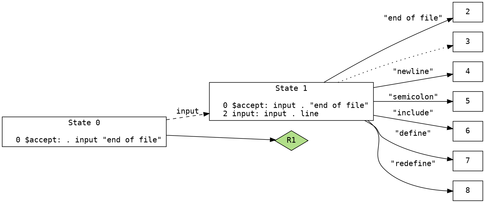

title: Vim Syntax Generator using Bison graph
date: 2020-10-05 17:00
status: published
tags: vim, bison, graph, nftables
category: HOWTO
summary: How to generate Vim syntax from Bison DOT graph


This article is on about auto-generating a 
Vim [Vim](https://github.com/vim/vim) 
syntax script by using just a 
[DOT](https://en.wikipedia.org/wiki/DOT_\(graph_description_language\)) graph.

Of course, we'll assume that this DOT graph file details the LR parsing
of its command line interface (CLI) or its configuration file.  

DOT graph on LR parser is usually created 
by [Bison](https://www.gnu.org/software/bison/) tool.

If you have (or about to create) highlighter scripts for Vim editor and 
have a YACC file to correlate with, this one is for you.

WHY AM I DOING THIS?
====================

I'm setting up a Linux firewall and `nft` (nftables CLI) tool is large 
and wieldy with 287 keywords.  No one should be forced to memorize all that.

So, [NFTABLES](https://wiki.nftables.org/), a real-world example, is 
being used to create this article. 

NFTABLES is arguable the largest parser that I 
have found across several source-code search engines.

To do a good comparison of parser size, we tabulate the node count 
and the edge count of a state machine tree used by its parser engine.  
and call that "parser-size" thereon.  (Hey, it's a rough term but
so is the comparison).

I've compiled our next smallest parser-size as:

[jtable]
Code,        Parser-Size
nftables,    1,412
Bind9 named, 1,082\*
GNU gdb-c,     440
lua,           418
GNU c,         392\*
nmap,          293 
[/jtable]

You can obtain parser-size by taking a `.y` (or `.yacc`) file 
and executing:
```bash
bison --graph=/tmp/x <yacc-file>
wc -l /tmp/x
```
The output roughly provides a parser-size.  Actual value is going to be
a static amount (around 10 or 11) less due to DOT graph header and footer
overhead.  (To me, that is an error margin that gets way smaller as the 
parser gets bigger.)

Note: \* Only Bind9 `named` configuration parser 
([`parser.c`](https://github.com/isc-projects/bind9/blob/main/lib/isccfg/parser.c)) 
had to be obtained manually as
Bind9 does not use DOT graph nor YACC/Bison: they actually hand-rolled 
their own LR parser.  

This article will equate my "parser-size" and this Vim syntax
command count (for `named`) as pretty well ... equivalent: this is
how I obtained `named` parser-size.

You can find my complete Vim syntax for Bind9 `named` 
configuration file in 
[Github egberts/vim-bind-named-syntax](https://github.com/egberts/vim-syntax-bind-named).  

Note: For GNU C parser, there are 32 keywords, 9 identifiers, 48 operators 
but many edges that interconnects them together.  (source: my compiler class).

INTRODUCTION
============
DOT is a graph description language, saved in text-based file ending with
a filetype of `.gv` (or `.dot`). 


with a goal to perform correct highlighting of some 1,400 
nftables' `nft` command keywords in a 
session.


A bit about me.  I've created very large Vim syntax files; DNS zone files, 
Bind9 named config, and a few in-house  ones to name a few.  

I'm about to tackle [NFTABLES](https://wiki.nftables.org/)
which appears to be twice the size (1400 states) than my largest Vim syntax
(Bind9 named is 936 states) and I'm getting tired, of strong-typing, that is.


But before I tackle this largest Vim syntax to date, I reflected on the
many repetitive methods used toward the creation of these large Vim syntaxes.
And after staring at a few starry nights, an idea occurred to me:

* leverage the DOT graph into some kind of Vim syntax script generator

Understandably, this approach would not work
for Bind9 (`named` has one of the largest handcrafted parser, which 
probably could benefit greatly from such a Bison parser).

Most importantly, if NFTABLES changes, our effort to recreate the syntax
gets easier.

All the relavant info are in the DOT file needed to pump out 
the necessary Vim syntax statements.  

* token name
* next possible token name(s)

BISON
=====
`bison` is a deterministic [LR parser](https://en.wikipedia.org/wiki/LR_parser)
or generalized LR (GLR) parser employing LALR(1) parser tables. 

`bison` has this CLI output option that creates GV-formatted files.
GV-formatted files (used to be called DOT-format but renamed
due to prevelance of Microsoft Word Template `.dot` filetype).

Note: "DOT" as a search term is still a significant anchor keyword and
its results on many search engines is better than "GV".

BASIC LR PARSER
---------------
Since `bison` is a parser, the reader is expected to be familiarized
with basic LR parser concept in general, particularily 
[shift-and-reduce](https://en.wikipedia.org/wiki/Shift-reduce_parser)
method. The shift-reduce parser's efficiency is from doing 
no backups or backtracking.

The following LR parser terms are used in this article:

* shift - Advances to the next token (or a node).
* reduce - coalesce multiple OR-logic after a token. Often used to reused other
  subgraphs.
* goto - Advances to a different state.

Reduce Transition
-----------------
Reduce transition is denoted by a special node id that has a letter "R"
between two node IDs.  For example, a reduce transition from Node 3 to Node 8
would be denoted as "3R8".

Lookahead
---------
A node may contain lookahead algorithms that are inside a pair of square 
brackets (`[` and `]` symbols.  

In lookahead algorithms, the current position has a special symbol 
called a 'dot' (which is not an ASCII period symbol).

In LR parlance, the presence of a dot, `.`, in a configuration represents the 
current lookahead position, with the lookahead symbol shown to the 
right of the dot (and which always corresponds to a terminal symbol), 
and the current stack state to the left of the dot (and which 
usually corresponds to a nonterminal symbol). 

GV Format option
----------------
Expanding on the many online tutorials having `bison`-generated GV examples, 
we will use a real example is derived here from 
the [NFTABLES](https://wiki.nftables.org/) command line (CLI) parser for 
a Linux firewall.
The first few lines of Bison-generated `nftables.gv` (generated 
from 
[`parser_bison.y`](http://git.netfilter.org/nftables/tree/src/parser_bison.y)
) can be created by executing:

```bash
cd  nftables/src
bison --graph=nftables.gv parser_bison.y
```
and the first few lines of `nftables.gv` content looks like:


GRAPHVIZ, the Python API
------------------------
Python-based [graphviz]() DOT translation tool was selected here
to import this `nftables.gv` into a dual-dictionary/list-based 
abstract syntax tree (AST): Python dictionary type contains the Edges
and list type contains the Nodes.

Graphviz makes available the `Graph`, `Node`, and `Edge` Python types 
easier for additional tree processing.

I've evaluated NetworkX, pydot, and a few others from Github and
have deemed Graphviz to be the most accessible to the graph tree, its nodes
and its lines more than any others software packages, which is 
what I needed the most.

Also using graphviz module, I've written a [dot-create-svg.py] tool
to create super-large scalable vector graphic (SVG) that can be 
viewable  on a web browser, `eog`, or Gnome `ImageViewer`.  
The largest DOT file
I've found on the Internet remains to be the Nftables; there are 1,400
nodes.

Note: ImageView can display my largest SVG image file better than 
Firefox/Linux or eog/Linux could ever hope to.

So, graphviz, it is. 

Take notes that python3-graphviz and pygraphviz are two separate 
but distinctive packages; we use python3-graphviz here.  This means
the Python import name is `graphviz`, not `pygraghviz`.

Node type
---------
Node is a state in a state machine that connects to one or more pathways
toward another state transition.

Node is represented as a single ID number (not using '->' symbol).

Node ID format may be an non-negative integer or a pair of
non-negative integer separated by a letter "R" (ie., "3R8").

Incidentially, Node is also a Python list type in python3-graphviz module.

Edge type
---------
Edge is that state transition between two states in a state machine.

Edge id is identified by a pair of node IDs.

Edge contains additional information that may contain any of the following:

* a token keyword or token symbol (a solid line, in DOT-graph) 
* a "reduce" transition toward another state (also a solid line)
* a "go to" another state (a dashed line)

Also, Edge is a Python dictionary type in python3-graphviz module.

VIM
======
Back to the
[designing](https://vim.fandom.com/wiki/Creating_your_own_syntax_files)
of a Vim syntax generator. 

Let's go over the constructors of Vim syntax:

* keyword, great for OR-logic of many tokens together
* match
* region

Keyword
-------
['Keyword'](http://vimdoc.sourceforge.net/htmldoc/syntax.html#:syn-keyword), 
in Vim syntax parlance, is a basic word-based syntax. 
Vim `keyword` does not support regex pattern matching.  

Vim keyword
is written as:
```vim
syntax keyword nftables_base_cmd add
```
that will look for the word `add` ANYWHERE in the current, displayed Vim buffer.

Valid character set for `keyword` is defined by `iskeyword`.
```vim
setlocal iskeyword=.,48-58,A-Z,a-z,\_,\/,-
```

Match
-----
[`Match`](http://vimdoc.sourceforge.net/htmldoc/syntax.html#:syn-match)
is the expanded version of keyword to support regex patterns instead
of a simple keyword.
```vim
syntax match nftables_Number '\d\+'
```
above example will match any sequence of digits.

Region
------
Another keyword that handles blocking and subblocking of reuseable patterns
is [`region`](http://vimdoc.sourceforge.net/htmldoc/syntax.html#:syn-region)
In the NFTABLES example:
```
table ip x {
    chain c {
        ct timeout set saddr map {
            192.168.0.14 :"policy1"
        }
    }
}
```
we have pairs of curly braces used often in a typical `nft` CLI that is
provided by NFTABLES.

Vim syntax provides `region` to deal with these curly braces (and other 
blocked portion of the parseable regions).
```vim
syntax region nftables_Table_region start='{' end='}'
```

Most importantly, option `contains=` for the `region` option is 
often used.

[`contained`](http://vimdoc.sourceforge.net/htmldoc/syntax.html#:syn-arguments)
is used to ensure that these patterns cannot be used elsewhere
except as referenced by other Vim syntax rules.  Not specifying `contained`
means to match anywhere, regardless of current state of Vim syntax
state machine.  No `contained` is usedful for comment lines, TODO highlighting,
include statement, and possibly error highlighting.


Mind-Meld
=========
We have two disparate sets of terminologies, Vim and Bison.

Now, putting it all together.

[jtable]
LR-parser, DOT graph, graphviz Python Type, Vim syntax, description
shift, solid line using integer Node ID, Edge, shift
reduce, solid line with a 'R' in NodeID, Edge, reduce
"go to", dashed, n/a, Edge, advance to the next state
state, Node, a state transition 

[/jtable]

Initial Design
--------------
Let's do 1st-round token identification for our first initial Vim syntax.

Nftables parser starts each new line with the following keywords:
`add`, `include`,
`define`, `redefine`, `undefine`, `element`, `map`, `flowtable`,
`set`, `ct`, `counter`, `limit`, `quota`, `replace`, `create`, 
`insert`, `delete`, `get`, `list`, `reset`, `describe`, `import`, 
`export`, `monitor`, `table`, `rule`, 
`ip`, `ip6`, `inet`, `netdev`, `bridge`, `arp` and can also
start with \<table\_name\>, \<chain\_name\> as well as a semicolon and
a comment line.

Such generated Vim statement would look like:
```vim
hi link nftables_base_cmd blue
syn keyword nftables_base_cmd skipwhite skipnl skipempty
\     add include define redefine undefine element map flowtable
\     set ct counter limit quota replace create 
\     insert delete get list reset describe import 
\     export monitor table rule 
\     ip ip6 inet netdev bridge arp 
```
We could call it a night and be done with the creation of 
this Vim syntax for `nftables`.  But, there's more... like 1400 more
of these states in the `nftables` LR-parser state machine.  Plus 
I like RED highlighting for any errors of typing.

Problem with the above Vim statement example is that there is no
way to do unique token processing for each of the main commands:
no unique highlighting after a such main command.  We want MOAR!

Before we go any further in writing Vim script, we need to navigate 
the DOT graph file and obtain these 1st-level (main) keywords.

It's a simple matter of following all non-R solid lines and noting
the name of each line (edge).


Each time we see in the DOT graph that encounters a token on a solid path 
to another state that does NOT have a letter 'R' in its node ID, we can
output the Vim syntax `match`/`keyword` statement.
