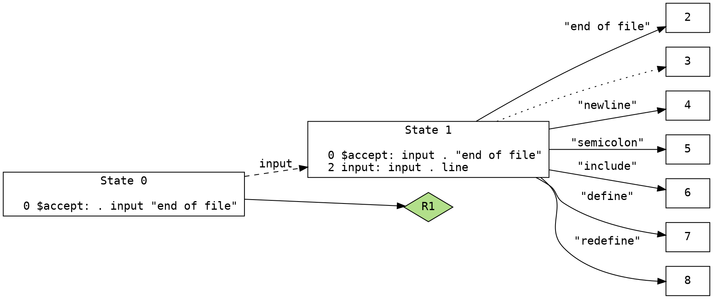

title: Vim Syntax Generator using Bison graph
date: 2020-10-05 17:00
status: published
tags: vim, bison, graph
category: HOWTO
summary: How to generate Vim syntax from Bison DOT graph


This article is about auto-generating syntax script used by 
[Vim](https://github.com/vim/vim) editor using just 
a [Bison](https://www.gnu.org/software/bison/)-generated 
[DOT](https://en.wikipedia.org/wiki/DOT_(graph_description_language) graph.

A bit about me.  I've created very large Vim syntax files; DNS zone files, 
Bind9 named config, and a few in-house  ones to name a few.  
I'm about to tackle [NFTABLES](https://wiki.nftables.org/)
which appears to be twice the size than my largest Vim syntax, 
and I'm getting tired, of strong-typing, that is.

But before I tackle this largest Vim syntax to date, I reflected on the
many repetitive methods used toward the creation of large Vim syntaxes.
And after staring at a few starry nights, an idea occurred to me:

* leverage the DOT graph into some kind of Vim syntax script generator

All the relavant info are in the DOT file needed to pump out 
Vim syntax statements.

* token name
* next possible token name(s)

BISON
=====
`bison` is a deterministic [LR parser](https://en.wikipedia.org/wiki/LR_parser)
or generalized LR (GLR) parser employing LALR(1) parser tables. 

`bison` has this CLI output option that creates GV-formatted files.
GV-formatted files (used to be called DOT-format but renamed
due to prevelance of Microsoft Word Template `.dot` filetype).

Note: "DOT" as a search term is still a significant anchor keyword and
its results on many search engines is better than "GV".

BASIC LR PARSER
---------------
Since `bison` is a parser, the reader is expected to be familiarized
with basic LR parser concept in general, particularily 
[shift-and-reduce](https://en.wikipedia.org/wiki/Shift-reduce_parser)
method. The shift-reduce parser's efficiency is from doing 
no backups or backtracking.

The following LR parser terms are used in this article:

* shift - Advances to the next token (or a node).
* reduce - coalesce multiple OR-logic after a token. Often used to reused other
  subgraphs.
* goto - Advances to a different state.

GV Format
---------
Expanding on may online tutorials on `bison`-generated GV examples, the
real example is derived here from the [NFTABLES](https://wiki.nftables.org/) 
command line (CLI) parser for Linux firewall.
The first few lines of `nftables.gv` got generated 
by executing on
[`parser_bison.y`](http://git.netfilter.org/nftables/tree/src/parser_bison.y):

```bash
cd  nftables/src
bison --graph=nftables.gv parser_bison.y
```
and its content of first few lines look like:


Node
----
Node is a state in a state machine that connects to one or more pathways
toward another state transition.

Node is represented as a single ID number (not using '->' symbol).

Node ID format may be an non-negative integer or a pair of
non-negative integer separated by a letter "R" (ie., "3R8").

Edge
----
Edge is that state transition between two states in a state machine.

Edge id is a pair of node IDs.

Edge contains additional information that may contain any of the following:

* a token keyword or token symbol (a solid line, in DOT-graph) 
* a "reduce" transition toward another state (also a solid line)
* a "go to" another state (a dashed line)

Reduce Transition
-----------------
Reduce transition is denoted by a special node id that has a letter "R"
between two node IDs.  For example, a reduce transition from Node 3 to Node 8
would be denoted as "3R8".

Lookahead
---------
A node may contain lookahead algorithms that are inside a pair of square 
brackets (`[` and `]` symbols.  

In lookahead algorithms, the current position has a special symbol 
called a 'dot' (which is not an ASCII period symbol).

In LR parlance, the presence of a dot, `.`, in a configuration represents the 
current lookahead position, with the lookahead symbol shown to the 
right of the dot (and which always corresponds to a terminal symbol), 
and the current stack state to the left of the dot (and which 
usually corresponds to a nonterminal symbol). 

VIM
======
Back to the
[designing](https://vim.fandom.com/wiki/Creating_your_own_syntax_files)
of a Vim syntax generator. 

Let's go over the constructors of Vim syntax:

* keyword, great for OR-logic of many tokens together
* match
* region

Keyword
-------
['Keyword'](http://vimdoc.sourceforge.net/htmldoc/syntax.html#:syn-keyword), 
in Vim syntax parlance, is a basic word-based syntax. 
Vim `keyword` does not support regex pattern matching.  

Vim keyword
is written as:
```vim
syntax keyword nftables_base_cmd add
```
that will look for the word `add` ANYWHERE in the current, displayed Vim buffer.

Valid character set for `keyword` is defined by `iskeyword`.
```vim
setlocal iskeyword=.,48-58,A-Z,a-z,\_,\/,-
```

Match
-----
[`Match`](http://vimdoc.sourceforge.net/htmldoc/syntax.html#:syn-match)
is the expanded version of keyword to support regex patterns instead
of a simple keyword.
```vim
syntax match nftables_Number '\d\+'
```
above example will match any sequence of digits.

Region
------
Another keyword that handles blocking and subblocking of reuseable patterns
is [`region`](http://vimdoc.sourceforge.net/htmldoc/syntax.html#:syn-region)
In the NFTABLES example:
```
table ip x {
    chain c {
        ct timeout set saddr map {
            192.168.0.14 :"policy1"
        }
    }
}
```
we have pairs of curly braces used often in a typical `nft` CLI that is
provided by NFTABLES.

Vim syntax provides `region` to deal with these curly braces (and other 
blocked portion of the parseable regions).
```vim
syntax region nftables_Table_region start='{' end='}'
```

Most importantly, option `contains=` for the `region` option is 
often used.

[`contained`](http://vimdoc.sourceforge.net/htmldoc/syntax.html#:syn-arguments)
is used to ensure that these patterns cannot be used elsewhere
except as referenced by other Vim syntax rules.  Not specifying `contained`
means to match anywhere, regardless of current state of Vim syntax
state machine.  No `contained` is usedful for comment lines, TODO highlighting,
include statement, and possibly error highlighting.


Mind-Meld
=========
We have two disparate sets of terminologies, Vim and Bison.

Now, putting it all together.

[jtable]
DOT line, Vim syntax, description
solid, shift
solid, reduce
dashed, "go to" the next state
[/jtable]

